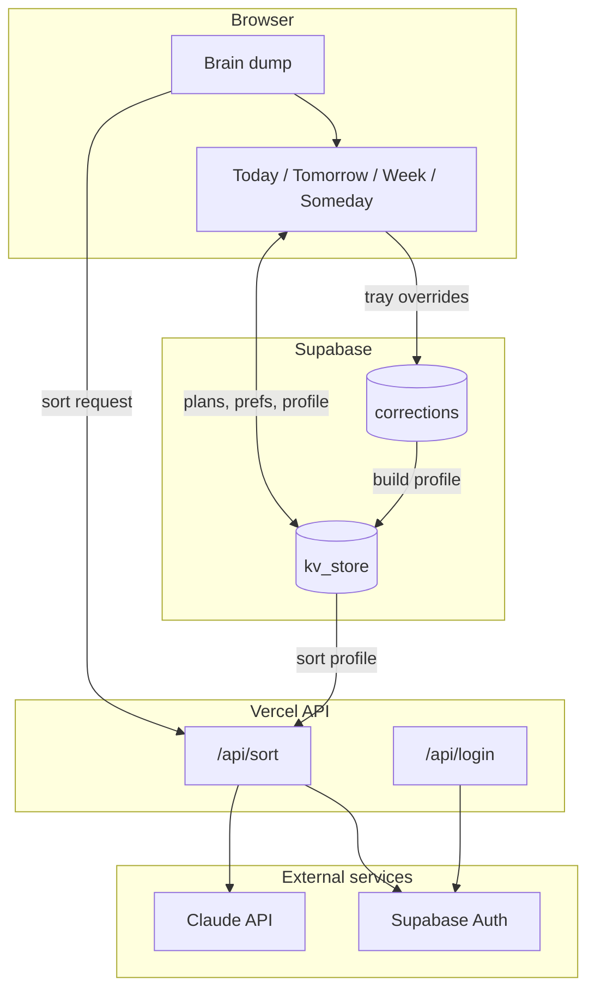
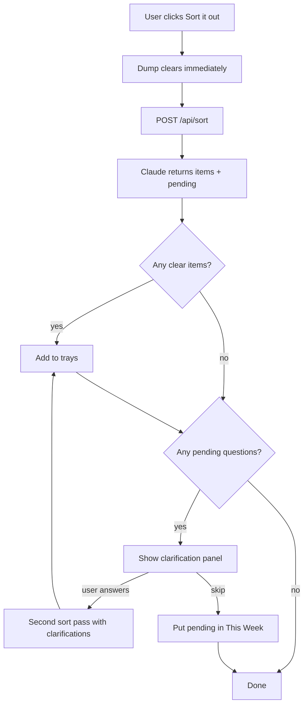
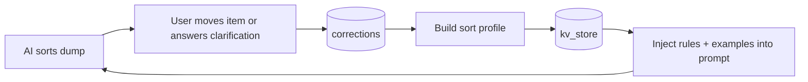

# Offload

An invite-only brain-dump app: throw everything on your mind into a tray,
and Claude sorts it into **Today**, **Tomorrow**, **This Week**, or **Someday**.

## What it does

- **Brain dump** — Type a stream-of-consciousness note; click **Sort it out** to split it into short, actionable tasks.
- **Background sort** — The dump clears immediately; sorting runs in the background so you can keep typing or start the next one.
- **Follow-up questions** — If something in the dump is too vague to assign a day, the app asks 1–2 clarifying questions before sorting the rest.
- **All open items, always** — On load, incomplete tasks from every saved day are consolidated into one view (no history or day-picker).
- **Daily capacity** — Set how much time and how many items fit in Today; the sorter respects those limits.
- **Learns your preferences** — When you move an item to a different tray, that correction is logged and used to personalize future sorts.



## How access control works

There is no public sign-up form. Accounts only exist if you (the admin)
add them:

```
npm run invite -- someone@example.com
```

This creates the user in Supabase **without sending email**. On the login
screen they enter that same address and click **Continue** — the app checks
the allowlist server-side (`api/login.js`) and signs them in immediately.
Unknown emails get: *"You haven't been invited yet."*

**Note:** Sign-in only checks that the email is on the allowlist — there is
no second factor (no magic link, no password). Fine for a small trusted group;
don't use this model for open/public apps.

## One-time setup

1. **Create a Supabase project** at supabase.com.
2. In the SQL editor, run `supabase/schema.sql` — this creates:
   - `kv_store` — per-user plans, preferences, recurring items, and sort profiles
   - `corrections` — tray overrides and clarification answers for personalization
   - Row Level Security policies so each user only sees their own data
3. In **Project Settings → API**, copy:
   - the Project URL → `VITE_SUPABASE_URL`
   - the `anon` `public` key → `VITE_SUPABASE_ANON_KEY`
   - the `service_role` `secret` key → `SUPABASE_SERVICE_ROLE_KEY`
     (keep this one out of git — see `.gitignore`)
4. Copy `.env.example` to `.env` and fill in those three values, plus an
   `ANTHROPIC_API_KEY` from console.anthropic.com.
5. (Optional, extra safety) In Supabase **Authentication → Settings**,
   turn off "Allow new users to sign up" so account creation is only
   ever possible through `npm run invite`.

If you deployed before the sort-profile feature, re-run `supabase/schema.sql`
so the `corrections` read policy is applied (`Users can read their own corrections`).

## Local development

```
npm install
npm run dev
```

Add yourself first so you have something to log in with:

```
npm run invite -- you@example.com
```

Then open the app, enter that email, and click **Continue**.

Note: `npm run dev` wires up `/api/login` and `/api/sort` locally via
`vite.config.js`. For full Vercel parity you can also use `npx vercel dev`.

## Deploying

1. Push this repo to GitHub.
2. Import it into Vercel (vercel.com → New Project → your repo).
3. In the Vercel project's **Environment Variables**, add for **Production**:
   - `VITE_SUPABASE_URL` and `VITE_SUPABASE_ANON_KEY` (used by the frontend build)
   - `SUPABASE_SERVICE_ROLE_KEY` (used by `/api/login` and `/api/sort`)
   - Recommended for API routes (same values as above): `SUPABASE_URL`, `SUPABASE_ANON_KEY`
   - `ANTHROPIC_API_KEY` (from [console.anthropic.com](https://console.anthropic.com) — server-only, single line, no extra newlines)
   **Important:** Vite embeds `VITE_*` vars at build time. After adding or
   changing them, you must **Redeploy** (Deployments → Redeploy) — saving
   env vars alone is not enough. Paste each secret as a **single line** with
   no extra newlines (a duplicated `SUPABASE_SERVICE_ROLE_KEY` breaks login).
4. Deploy. You'll get a URL like `offload-yourname.vercel.app`.
5. Add people (no email sent):
   ```
   npm run invite -- friend@example.com
   ```
   Share your app URL — they sign in with that email on the login screen.

## How sorting works



1. The frontend sends the dump to `POST /api/sort` with open items, daily capacity prefs, and the user's **sort profile**.
2. `shared/sortPrompt.js` builds the prompt (single source of truth for prod and eval).
3. Claude returns `{ items, pending }` — clear tasks plus any follow-up questions.
4. Clear items land in trays immediately; ambiguous parts show a clarification panel.
5. Answers are sent back for a second sort pass; skipped items default to This Week.

Key files:

| File | Role |
|------|------|
| `shared/sortPrompt.js` | Prompt template and response parser |
| `shared/sortProfile.js` | Builds personalization rules from corrections |
| `shared/preferences.js` | Daily capacity defaults and helpers |
| `api/sort.js` | Auth, rate limit, Anthropic call |

## Testing sort accuracy

```
npm run eval
```

Runs `eval/dataset.json` (70 hand-labeled examples across all four
categories) through the exact same prompt `api/sort.js` uses, and prints:

- overall + per-category accuracy
- a confusion matrix (which categories get mixed up with which)
- every mismatch, so you can see the actual wrong answers, not just a number
- response/parse errors, if any

Check consistency (does the model give the same answer to the same input
every time?) by running more calls per item:

```
CONSISTENCY_RUNS=3 npm run eval
```

Re-run this after any prompt change (`shared/sortPrompt.js`) to see whether
it actually helped. Add new rows to `eval/dataset.json` as you discover
real-world miscategorizations — that's the highest-value use of this file
over time.

## Personalization from corrections



Whenever someone changes the category the AI assigned to an item, that gets
logged to the `corrections` table with the item text, the AI's original
category, and what the person corrected it to. Clarification answers from
ambiguous sorts are logged the same way (`ai_category = pending`).

The app reads your recent corrections, builds a **sort profile** (rules +
few-shot examples), caches it in `kv_store`, and injects it into every
`/api/sort` call. The more you correct trays, the better future sorts match
your now-vs-later preferences.

To review raw signals, query Supabase directly (SQL editor or table view):

```sql
select ai_category, corrected_category, count(*)
from corrections
group by 1, 2
order by 3 desc;
```

If a particular `ai_category -> corrected_category` pair keeps showing up,
that's a good candidate to add to `eval/dataset.json` too.

## Notes

- `api/sort.js` has a basic in-memory rate limit (30 sorts/hour/user) to
  protect your Anthropic quota. It resets on cold start, so it's a soft
  limit — fine to start with, worth replacing with a real store (a
  Supabase table, or Upstash) if this gets real usage.
- To revoke someone's access, delete their user from
  **Supabase → Authentication → Users**. Their rows in `kv_store` and
  `corrections` are deleted automatically (`on delete cascade`).
